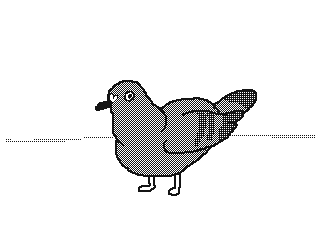

# 챕터1 Clean Code

## 1.1 코드가 존재하리라

모든것들이 자동화되듯이 코드도 자동화가 될까? 절대 그럴일은없다!

왜냐하면 코드는 요구사항을 상세히 표현하는 수단이니깐!

그렇기에 추상화도 불가능하다 정확하게 명시해야한다.

기계가 실행할정도로 상세하게 요구사항을 명시하는 작업, 이것이 프로그래밍이다. 이렇게 명시한 결과가 바로 코드이다.

요구사항을 애매하게 주어도 의도를 완벽히 꿰뚫어 프로그램을 완벽하게 실행하는 기계는 없다.

창의력과 직관을 보유한 인간조차도 고객의 막연한 감정만으로 성공적인 시스템을 구현하지 못하는것과 마찬가지이다. 😀

### 궁극적으로 코드는 요구사항을 표현하는 언어라는 사실을 명심하자

## 1.2 나쁜 코드

나쁜 코드로 발목이 묶여서 고생한 기억들이 있으신지...? 조금이라도 프로그램을 짜보았다면, 수없이 경험했을것이다. 그렇다면 우리는왜 나쁜 코드를 짰을까??

마감이 얼마안남아서, 허겁지겁 만들어서 제대로 짤 시간도없고 코드를 다듬을 시간도 없었기때문에... 너, 나 우리... 모두가 격어본적이있다.

우리는 코드를 다짠뒤 생각을한다. 우리가 만든 쓰레기 코드를보며 "아, 나중에 고쳐야겠다...", "돌아가기만 하면 되지..."

하지만 우리는 르블랑의 법칙을 알아야했다...

### "나중은 결코 오지 않는다."

## 1.3 나쁜 코드로 치르는 대가

나쁜 코드는 개발 속력을 크게 떨어트린다. 코드를 고칠 때마다 엉뚱한 곳에서 문제가 생긴다. 시간이 지날수록 간단한 변경은 없다. 매번 얽히고 설킨 코드를 '해독'해 얽히고설킨 코드를 더한다. 시간이 지나며 쓰레기 더미는 점점 높아지고 깊어진다. 청소할 방법이 없다.

나쁜코드가 쌓일수록 생산성은 떨어지고, 떨어진 생산성을 복구하려는 시도를 한다. 하지만 수정을 위해 투입된 새로운 인원은 시스템 설계를 충분히 이해하지 못한상태로 무엇이 설계의도인지 아닌지 구분을 하지못한다. 그리고 생산성을 늘려야하는 압력을 느낀다. 결국 어찌되느냐? 같은실수를 반복한다... 나쁜 코드를 더 많이 만들어 내는것이다.

### 원대한 재설계의 꿈

마침내 프로그래머는 반기를 든다. 이런 코드로 더이상 일을 못하겠다고... 처음부터 다시만들자 관리자를 설득한다. 관리자는 자원을 쓰기 싫지만 생산성이 떨어진것을 부인할수없으니 허락한다. 그렇게 재설계 팀이 만들어진다. 재설계팀은 두가지를 만족해야한다. 기존 시스템을 모두 제공하는 새로운 시스템 그리고 기존 시스템에 가해지는 변경을. 새 시스템이 기존 시스템을 100% 제공하지않으면 새 시스템은 의미가없다. 재설계팀은 오랬동안 작업을 이어가고 시간이 길어질수록 많은 사람이 나가고 또 들어오게 된다. 그렇게되면 새 시스템팀에 들어온 새로운 팀원들은 새 시스템을 새새시스템으로 설계하자고한다. 왜? 엉망이여서!

이런일을 겪는다면 시간을 들여서라도 클린 코드를 만들려는 노력이 비용도 절감하고 전문가로서 살아남는 길이라는것을 알게될것이다.

### 태도

좋은 코드가 어째서 순식간에 나쁜 코드로 전락할까? 그 이유는 바로 우리, 프로그래머들에게 있다. 어떠한 상황이라도 좋은 코드를 사수하는 일은 우리 프로그래머들의 책임이다. 나쁜 코드의 위험을 이해하지 못하는 관리자 말을 그대로 따르는 행동은 전문가 답지 못하다.

### 원초적 난제

우리는 나쁜 코드가 업무 속력을 낮춘다는 사실을 익히 안다. 그럼에도 기한을 맞출려면 나쁜 코드를 양산할 수 밖에 없다고 느낀다. 그들은 빨리 가려고 시간을 들이지 않는다. 하지만 진짜 전문가는 나쁜 코드를 양산하면 오히려 기한을 맞추지 못한다는것을 안다. 기한을 맞추는 유일한 방법은, 즉 빨리 가는 유일한 방법은, 언제나 코드를 최대한 깨끗하게 유지하는 습관이다.

### 클린 코드라는 예술

나쁜 코드가 장애물이고 빨리 가려면 코드를 깨끗하게 유지해야하는 사실을 알았다면 이제 다음 질문을 던질 차례이다. "클린 코드를 어떻게 작성할까?" 클린 코드가 무엇인지를 알아야 클린 코드를 짤수있다. 나쁜 코드와 좋은 코드를 구분할줄 알아야하고, 좋은 코드를 작성할줄 알아야한다.

우리는 코드 감각이 있어야한다. 코드 감각이 있는 사람은 나쁜 모듈을 알아보기뿐만 아니라 좋은 모듈로 개선할 방한을 떠올린다.

다시 말해, 클린 코드를 작성하는 프로그래머는 빈 캔버스를 우아한 작품으로 바꿔가는 화가와 같다.

### 클린 코드란?

클린 코드의 정의는 프로그래머의 수만큼이나 정의도 다양할것이다. 그래서 이 분야에서 유명하고 노련한 사람들의 의견을 물었다.

"우아하고 효율적인 코드"

"단순하고 직접적 명쾌한, 마치 잘쓴 문장처럼 읽힌다."

"작성자가 아닌 사람도 읽기 쉽고 고치기 쉽다."

"누군가 주의 깊게 짰다는 느낌을 주는"

"중복을 피하라, 한 기능만 수행하라, 제대로 표현하라, 작게 추상화하라"

## 1.4 우리들 생각

클린 변수 이름, 클린 함수, 클린 클래스를 만드는 방법을 소개한다. 코드를 가르침은 마치 무술의 종파와 같다. 절대적으로 옳은 종파는 없다. 하지만 속한 종파 안에서는 절대적이다. 하나의 종파에서 무술을 마스터했으면 다른 종파에 가서 또 새로운 무술을 배우는것처럼 코드도 마찬가지이다.

## 1.5 우리는 저자다

우리는 저자다. 저자에게는 독자가 있다. 그리고 저자에게는 독자와 잘 소통할 책임도 있다. 다음에 코드를 짤 때는 자신이 저자라는 사실을, 여러분의 노력을 보고 판단을 내릴 독자가 있다는 사실을 기억해야겠다.

우리는 코드를 짤때 대부분의 시간을 화면을 스크롤하거나 다른 모듈을 찾아보는 동작에 사용한다. 즉 코드를 읽는시간이 짜는 시간보다 훨신 크다는 것이다. 그렇기에 읽기 쉬운 코드를 만든다는것은 중요하다. 기존 코드를 읽어야 새 코드를 짜므로 읽기 쉽게 코드를 짜면 새로 코드를 짜는것도 쉽다.

## 1.6 보이 스카우트 규칙

### 캠프장은 처음 왔을 때보다 더 깨끗하게 해놓고 떠나라

코드를 잘 짰다고 전부가 아니다. 시간이 지나도 언제나 깨끗하게 유지해야 한다. 시간이 지나면서 엉망으로 전락하는 코드가 한둘이 아니다.

체크인할 때보다 좀더 클린 코드를 체크인한다면 코드는 절대로 나빠지지 않는다. 한꺼번에 많은 시간과 노력을 들일 필요가 없다. 변수 이름하나 개선하고, 조금긴 함수 하나 분활하고, 약간의 중복을 제거하고, 복잡한 if문 하나를 정리하면 충분하다.

## 1.7 전편과 원칙

이 책을 읽은후에 Agile Software Development: Principles, patterns, and Practices(PPP) 이책을 읽어보라. ppp책은 이 책에서 하는 이야기를 이어간다. 객체 지향 설계의 원칙을 설명하고 전문 개발자들이 사용하는 실무 기법을 소개한다.

## 1.8 결론

예술에 대한 책을 읽는다고 예술가가 된다는 보장은 없다. 책은 단지 다른 예술가가 사용하는 도구와 기법과 절차를 소개할 뿐이다. 이책도 마찬가지이다. 단지 우수한 프로그래머가 생각하는 방식과 그들이 사용하는 기술과 기교와 도구를 소개할 뿐이다.

### 나머지는 우리에게 달렸다. 실천, 연습, 행동

> 로버트 C. 마틴, 『Clean Code 클린 코드』, 박재호, 이해영 옮김, 케이앤피북스(2010), P35-51.
>